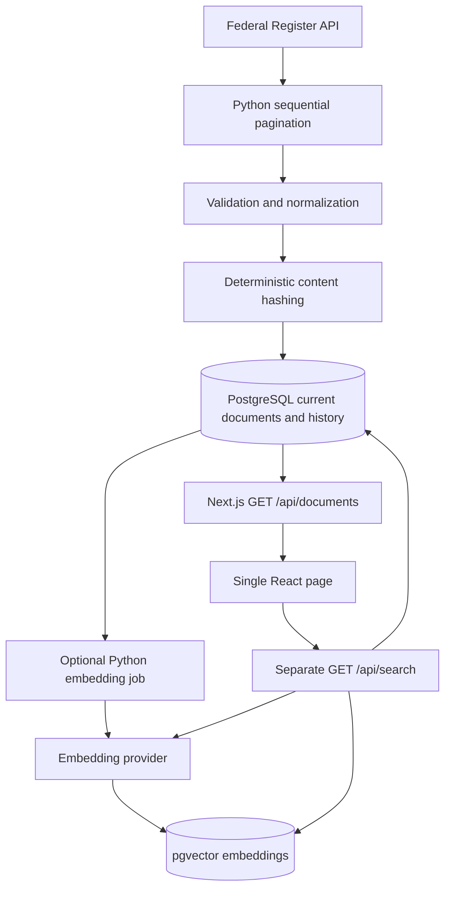
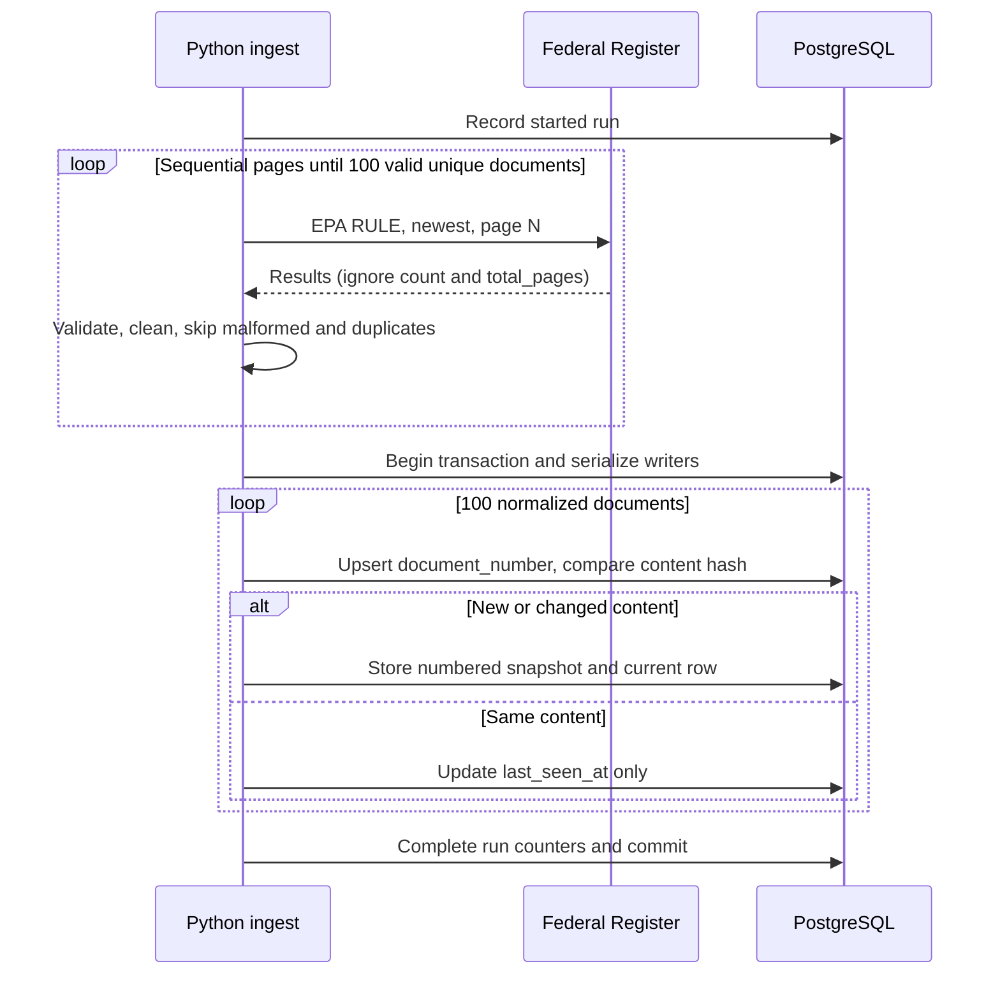
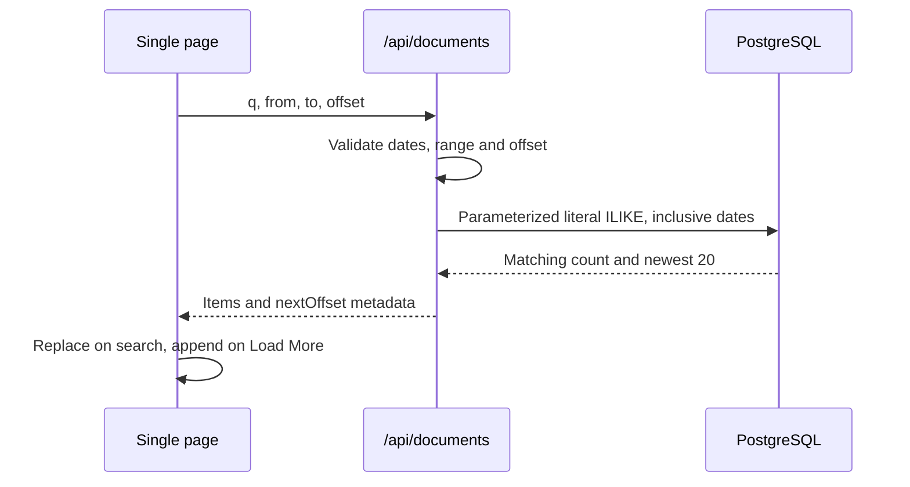
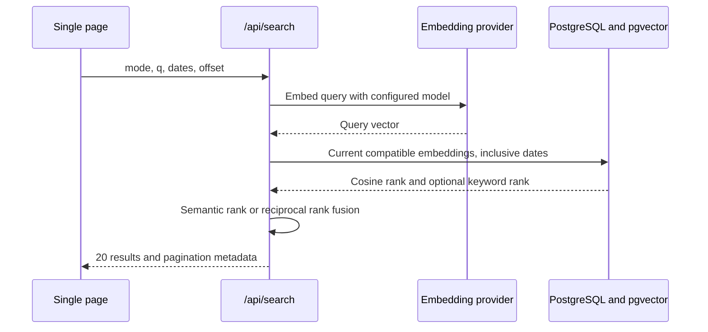
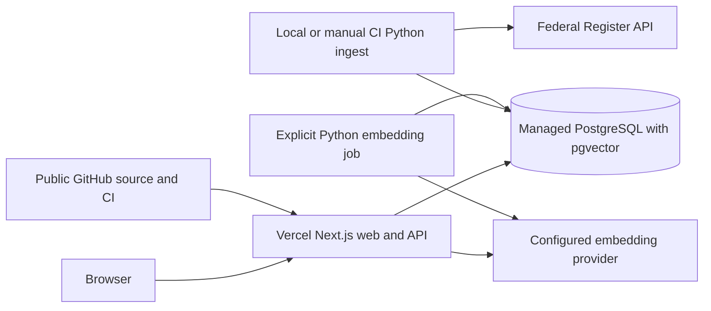

# Architecture

Python fetches, validates and normalizes recent EPA Rules into PostgreSQL. Next.js serves current records through the required TypeScript API and displays them on one React page. Required browsing has no embedding-service dependency. Optional semantic/hybrid queries use a separate endpoint and pgvector. See [requirements](requirements.md).

## Components

## Ingest sequence

Fetch all 100 before modifying documents. A failed fetch leaves existing documents untouched. Store the entire batch atomically; failed writes roll back the batch. A transaction-scoped advisory lock serializes ingestion writers so concurrent runs cannot create competing versions. Run diagnostics use a separate committed start/failure record.

## Required keyword sequence

## Optional relevance search sequence

Stale embeddings are excluded using the hash of searchable content. Missing credentials or incomplete embeddings return a useful readiness error from the enhancement only. No implicit fallback changes the meaning of a search mode.

## Deployment

Only server processes receive database credentials. Ingestion and embeddings are explicit commands, outside request handling. PostgreSQL access uses standard drivers and SQL migrations, preserving provider portability.
