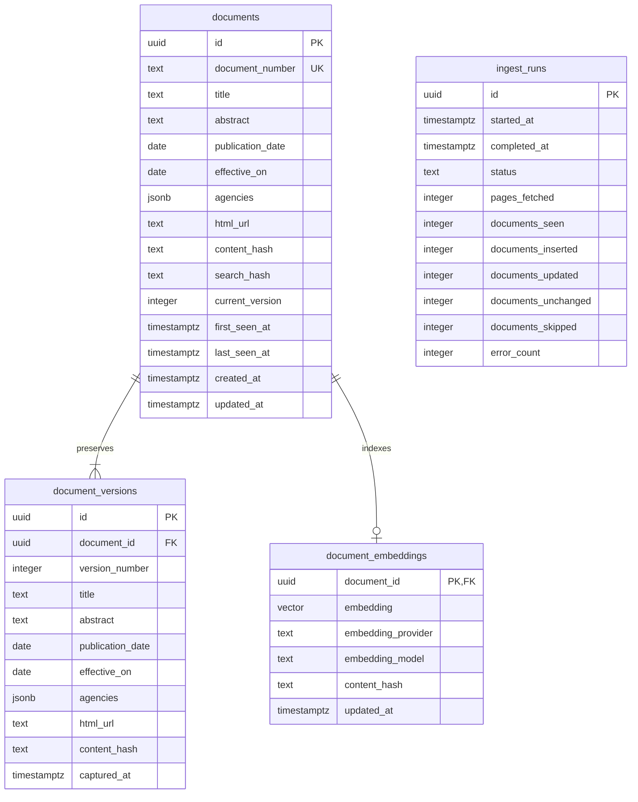

# Database

PostgreSQL is the user's selected storage. Use an internal UUID and unique Federal Register document_number. Preserve one current row, immutable numbered snapshots, optional embeddings, and ingestion run diagnostics. Transactions must preserve documents and history together. No deletion of documents absent from later source batches.

Unique `(document_id, version_number)` prevents duplicate versions. The external identifier is never the title. `content_hash` hashes all normalized source fields; `search_hash` hashes title and abstract only. Embedding `content_hash` stores this searchable-content hash, avoiding re-embedding a date-only change. Compatible model and provider metadata must match the query configuration.

Indexes: primary/unique keys plus `(publication_date DESC, document_number DESC)` for deterministic baseline pagination. At 100 records, sequential literal substring and vector scans are simpler than speculative trigram/HNSW indexes. Revisit with query plans at larger scale.

Apply numbered SQL migrations transactionally with a migration ledger and advisory lock. The baseline schema migration is independent of the optional vector extension migration. Production uses a dedicated server-side database connection; public anonymous data APIs must not expose tables.
